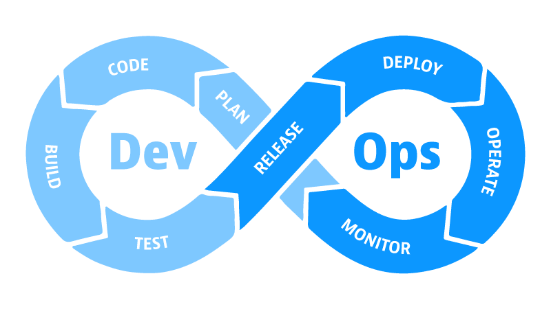
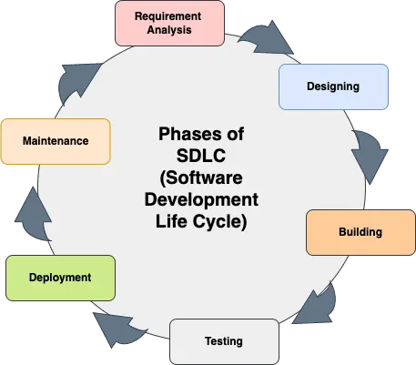

# INTRODUCTION TO DEVOPS

## The Concept of DevOps
#### What is DevOps
DevOps in simple terms is the integration of the 2 main aspects/stages of software development and implementation (the development stage which is includes the planning and writing of the software code and the Operations stage which is the deployment and maintenance of the software). This means that DevOps ensure codes written for softwares are deployed to end users quickly and without issues thus eliminating common software development problems such as the historical extensive time it takes to write and deploy software codes. To do this, tools and methodologies such as Continuous Integration and Continuous Delivery or Continuous Deployment (CI/CD) automation tools are employed to progress software code through the various steps of development to deployment with the IT teams involved able to review the code and make necessary changes and deploy the code immediately without any wait times.

#### Benefits of DevOps
The benefits of DevOps include:
- quick delivery of software from development and deployment to end users 
- little to no downtime when improvements or updates are being carried out to the software
- most manual development work reduced due to automation processes employed
- better communication, coordination and collaboration between IT teams increased communications between IT groups.

#### History of DevOps
DevOps emerged as a matter of necessity during a period in software development where the development stage and operations/implementation stage were separated and carried out by separate teams without any appropriate collaboration or communication between the teams. Basically, one team (code writers or developers) after finishing their code pass it on to the next team (Operations) to figure out how to make it work without any input or advisory from the devs. This caused a lot of issues as operations team lacking in understanding of the code misinterpret or are totally unable to deploy the code leading to time and cost overruns. The need to solve this problem gave rise to DevOps as a philosophy and further as an IT field in software development. This however didn't happen suddenly. An agile practitioner, Patrick Debois ran into this same issues while working on a complex project in 2007. He identified the lack of collaboration and communication between the development and operations team as an hindrance to the project being carried out and in 2009 called for a meeting of developers and system administrators to discuss ways to overcome the challenges resulting from a lack of cooperation between the two teams. This meet was called DevOpsDays. This led to the continuous development and adoption of various DevOps ideas, practices and tools which now constitute what DevOps culture is today. 

#### DevOps Culture
DevOps culture essentially means the adoption and use of new practices and methodologies such as changing from separate silo tasks to seemless collaboration between developers and operations engineers and use of inter-team tools to achieve common goals. Essentially, it is an holistic adoption of change to software development through continuous learning and continuous improvement, fast implementation and feedback, and good cross-team collaboration.

## SDLC (Software Development LifeCycle)
#### The Concept of SDLC
The SDLC is essentially the steps, processes or path a software follows beginning as an idea and progressing all the way to its deployment and maintenance for intended end users. These steps in order include:
1. *Planning* which entails identifying end user needs and specification, cost and budgeting, completion/delivery scheduling, IT team selection etc
2. *Designing* which entails interface and database design/models, coding standards etc
3. *Building* which involves actual writing of the code and building of the database and interface and integrating them
4. *Testing* which involves testing of the built software for performance, security, defects and bugs 
5. *Deploying* which involves moving the tested software into production and releasing the software for use by end users
6. *Maintaining* which involves maintaining and enhancing the software through updates and patches to fix issues and add new features from client or end user feedback as well as other post-deployment activities such technical support and performance monitoring 

#### Why is it important for a DevOps Engineer?
The SDLC layouts a path for which software follows and a DevOps engineer must ensure that the software progresses along this path smoothly correctly and quickly as utilizing the software development life cycle sets projects up for long term success. A well structured SDLC process leads to higher-quality software built securely within budget and schedule. Also, The DevOps engineer must understand the SDLC and the factors associated with it such as requirements, team culture, and project size influence to ensure the DevOps methodology is the most suitable for a software development project. For example some modern teams prefer to use agile frameworks such as Scrum to accelerate software delivery. 

#### Where does DevOps fit in SDLC ?
In SDLC, various models and methodologies can be used to carry out the whole process. DevOps is one of such methodologies which involves the collaboration of the teams responsible for the development and operations stages of the life cycle from inception to completion. Other methodologies used are Agile which uses Iterative cycles and incremental delivery, Rapid application development (RAD) which is a fast paced adaptive development and the traditional Waterfall methodology of Sequential stages which separated the teams involved in software development into silos and created communication and collaboration issues DevOps was created to overcome.

#### Can DevOps improve the SDLC Process?
DevOps emphasizes automation, collaboration, and continuous feedback throughout the entire software development and operations process. With a DevOps model employed in SDLC, miscommunication issues leading to delays associated with methodologies such as waterfall are eliminated thus reducing and fast tracking the SDLC. Through the use of DevOps, all the steps in the SDLC are greatly improved. Collaboration between all teams involved in all the steps lead to smooth progress of the SDLC. DevOps tools for automation, testing and monitoring are also employed in the SDLC which help to improve the process and produce high quality software for end users, quick fixes to identified issues and bugs and rapid deployment of new features and upgrades.

